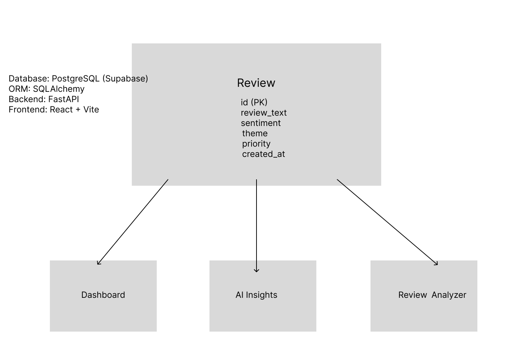

# StayInsight AI

AI-powered guest feedback intelligence platform for homestays and eco-tourism businesses.

---

## Project Overview

StayInsight AI helps homestay owners and eco-tourism businesses analyze guest reviews, identify satisfaction trends, discover recurring issues, and generate actionable insights from customer feedback.

### Core Modules

- Dashboard Analytics
- AI Insights Engine
- Review Analyzer
- Guest Feedback Management

---

## Tech Stack

### Frontend
- React
- Vite
- React Router
- Tailwind CSS

### Backend
- FastAPI
- Python

### Database
- PostgreSQL (Supabase)

### ORM
- SQLAlchemy

---

# Backend Setup

## Navigate to Backend

```bash
cd backend
```

## Create Virtual Environment

```bash
python -m venv venv
```

## Activate Environment

### Windows

```bash
venv\Scripts\activate
```

### Mac/Linux

```bash
source venv/bin/activate
```

## Install Dependencies

```bash
pip install fastapi uvicorn python-dotenv sqlalchemy psycopg2-binary
```

## Run Server

```bash
python -m uvicorn main:app --reload
```

The backend will be available at:

```text
http://127.0.0.1:8000
```

---

## API Documentation

Swagger UI:

```text
http://127.0.0.1:8000/docs
```

---

# Database Choice

StayInsight AI uses **PostgreSQL through Supabase** as its database solution.

### Why PostgreSQL + Supabase?

- Structured review data fits naturally into a relational database.
- Supabase provides a free cloud-hosted PostgreSQL database.
- Easy integration with FastAPI and SQLAlchemy.
- Supports future scalability and analytics features.
- Secure environment variable management using `.env`.
- Reliable cloud-based persistence compared to in-memory storage.

---

# Database Schema

The application currently uses a single Review entity to store guest feedback data.

| Field | Type |
|---------|---------|
| id | Integer (Primary Key) |
| review_text | String |
| sentiment | String |
| theme | String |
| priority | String |
| created_at | DateTime |

### This Data Powers

- Dashboard Analytics
- AI Insights Engine
- Review Analyzer

---

# Schema Diagram

Add your Week 5 schema diagram image below:





---

# Database Setup

## Supabase Setup

1. Create a Supabase project.
2. Navigate to **Project Settings → Database**.
3. Copy the PostgreSQL connection string.
4. Add the connection string to `.env`.

Example:

```env
DATABASE_URL=your_supabase_connection_string
```

---

## Environment Variables

Create a `.env` file:

```env
DATABASE_URL=your_supabase_connection_string

APP_NAME=StayInsight AI Backend
API_VERSION=1.0.0

FRONTEND_URL=http://localhost:5173
```

---

# Week 5 Database Features

Implemented Features:

- PostgreSQL database using Supabase
- SQLAlchemy ORM integration
- Review table with persistent storage
- CRUD operations using database records
- Dashboard statistics generated from database
- Dashboard trend analytics using timestamps
- AI Insights generated from stored reviews
- Secure environment variable management using `.env`
- Automatic timestamp generation for new reviews

---

# Current API Endpoints
### Database Operations

All CRUD operations are persisted in PostgreSQL (Supabase) using SQLAlchemy ORM.
## Review Management

| Method | Endpoint |
|----------|----------|
| GET | /reviews |
| GET | /reviews/{id} |
| POST | /reviews |
| PUT | /reviews/{id} |
| DELETE | /reviews/{id} |
| GET | /reviews/search |

## Review Analyzer

| Method | Endpoint |
|----------|----------|
| POST | /analyze-review |
| POST | /generate-response |

## Dashboard

| Method | Endpoint |
|----------|----------|
| GET | /dashboard/stats |
| GET | /dashboard/trends |

## AI Insights

| Method | Endpoint |
|----------|----------|
| GET | /insights |
| GET | /insights/recommendations |

---

# Future Enhancements

- User Authentication
- Multi-property Support
- AI-Powered Review Summaries
- OpenAI / Gemini Integration
- Real-Time Analytics Dashboard
- Advanced Trend Visualization
- Cloud Deployment

---

## Author

Developed as part of the **TBI-GEU Summer Internship Program 2026**.